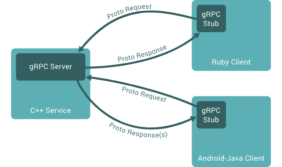

### gRPC

#### python端
[gRPC框架官方教程-python](https://grpc.org.cn/docs/languages/python/basics/)



-  四种服务(流式与一元)：
```proto
rpc SayHello(HelloRequest) returns (HelloResponse);
...
rpc SayHello(stream HelloRequest) returns (stream HelloResponse);
// 区别在于stream关键字
// rpc client(client-data-structure) returns (server-data-structure) {}
```

1. **安装grpc**
  ```powershell
  pip install grpcio
  pip install grpcio-tools
  ```

2. **简单服务定义**
   *vscode推荐下载vscode-proto3插件*
   ```proto
   syntax 'proto3'; // 指定proto buffers版本为proto3

   package Service // package用于创建命名空间，相当于c++的namespace

   //此外，还有option关键字用于指定protoc编译器的某些行为

   service ServiceName {
    //method
    rpc client(client-data-structure) returns (server-data-structure) {}
   }

   message client-data-structure {
    int32 interval = 1;
    // 这里的1并不是internal的默认指，而是internal在client-data-structure这个message的编号
    bool var1 = 2;
    repeated int32 IntArr = 3; // 用repeated关键字定义数组
    ...
   }

    ...
    ```

3. 利用proto根据.proto文件自动生成python文件
   ```powershell
   python -m gprc_tools.protoc \
    -I{dir-where-protofiles-in} \
    --python_out={output-files-of-.py-files} \
    --pyi_out={output-files-of-.pyi-files} \
    --grpc_python_out={grpc-python-code} \
    {relative-path-of-the-.proto-files}
   ```
   示例：
   ```powershell
   python -m grpc_tools.protoc -Igrpc/example/custom/path=../../protos --python_out=. --grpc_python_out=. ../../protos/route_guide.proto
   ```
  

4. 利用生成的{}_pb2_grpc.py和{}_pb2.py编写服务端和客户端代码
  - 客户端(server.py)：
    ```python
    import grpc
    from concurrent import futures

    import {}_pb2_grpc
    import {}_pb2

    #例如 对应try.proto, server.py需要实现 class TryServicer({}_pb2_grpc.TryServicer) 用大驼峰命名
    #这个class需要继承grpc_tools自动实现的类{proto文件名大驼峰}
    class {}Servicer({}_pb2_grpc.{}Servicer):
      #在类里面实现你在.proto文件里面写的功能
      #比如rpc FuncClient(Request) returns (Response)
      #你就要实现def FuncClient(self, request, context):
      #request里面包含的是你的请求，可以理解为message关键字定义的数据相当于一个json
      #context包含你的请求上下文，比如客户端的ip，定义响应状态，设置超时等，可以通过context设置。
      def FuncClient(self, request, context):
        return {}_pb2.{Client-data-structure}({key} = f"value: {value}")
        #我的理解是，{}_pb2_grpc.py定义的是服务的行为，{}_pb2.py定义的是数据的行为。
        #不同于python的data.{}={}的数据赋值形式，这里采用类函数的传入赋值，
        #而且没有position编码，你必须显式指定你的value赋值给哪个key，不然报错。


    def serve(): #服务
      server = grpc.server(futures.ThreadPoolExecutor(max_workers = 10)) # 创建server
      {}_pb2_grpc.add_{}Servicer_to_server(
        {}Servicer(), server
      ) # 这个add_{}_to_server被称为注册函数，用于将你实现的服务的类注册到grpc服务器商，并用创建的server进程池部署服务
      server.add_insecure_port("[::]:50051") # 监听所有50051端口
      server.start() # 启动服务
      server.wait_for_termination() # 这句代码用于在服务器显式关闭的时候关闭服务，但是感觉用处不大，直接stop(times)感觉更实用。

    if __name__ == '__main__':
      server()
    ```
    这是最简单的服务端代码样板，实际需要自己按需拓展。
    <br>
  - 客户端代码(client.py):
    ```python
    import grpc
    import {}_pb2_grpc
    import {}_pb2
    #主要实现run()方法，对服务端定义的接口进行请求。
    run():
      channel = grpc.insecure_channel("{}:50051") # 定义通道
      stub = {}_pb2_grpc.{}Stub(channel) # 对于服务中的每个方法，编译器都会使用相同名称向 stub 对象添加一个对应的属性。，见下面
      response = stub.FuncClient({}_pb_2.Client_data_structure({key} = {value}))
      # 利用服务端的FuncClient服务进行请求.将返回的数据保存到response变量中
      print(response.{key}) # 对response进行操作。

    if __name__ == '__main__':
      run()
    ```

5. 启动服务：
   ```bash
   python server.py
   // 新开一个终端启动客户端
   python client.py
   ```

#### cpp端

[grpc教程-cpp](https://grpc.org.cn/docs/languages/cpp/quickstart/)

1. 安装必要工具，以linux为例（wsl)
  ```bash
   export MY_INSTALL_DIR=$HOME/.{dirName}
   mkdir -p $MY_INSTALL_DIR
   export PATH="$MY_INSTALL_DIR/bin:$PATH"
   echo "安装bash"
   wget -q -O cmake-linux.sh https://github.com/Kitware/CMake/releases/download/v3.30.3/cmake-3.30.3-linux-x86_64.sh
   sh cmake-linux.sh -- --skip-license --prefix=$MY_INSTALL_DIR
   rm cmake-linux.sh
   echo "安装grpc基本工具"
   sudo apt install -y build-essential autoconf libtool pkg-config
   echo "grpc本身"
   git clone --recurse-submodules -b v1.66.0 --depth 1 --shallow-submodules https://github.com/grpc/grpc
   echo "安装grpc和proto buffers"
   cd grpc
   mkdir -p cmake/build
   pushd cmake/build
   cmake -DgRPC_INSTALL=ON \
         -DgRPC_BUILD_TESTS=OFF \
         -DCMAKE_CXX_STANDARD=17 \
         -DCMAKE_INSTALL_PREFIX=$MY_INSTALL_DIR \
         ../..
   make -j 4
   make install
   popd
  ```
2. proto文件的编写是跨语言的，与python同

3. server端同步接口编写
  ```cpp
  #include <grpc/grpc.h>
  #include <grpcpp/security/server_credentials.h>
  #include <grpcpp/server.h>
  #include <grpcpp/server_builder.h>
  #include <grpcpp/server_context.h>
  #include "path/to/grpc.pb.h"

  using grpc::Server;
  using grpc::ServerBuilder;
  using grpc::ServerContext;
  using grpc::ServerReader;
  using grpc::ServerReaderWriter;
  using grpc::ServerWriter;
  using grpc::Status;
  using {protoName}::{data-structure};
  ...
  using std::chrono::system_clock;  // time module
  
  class {}Impl final : public {}:Service {
    public: 
      explicit {}Impl(const std::string& db){
        {}::ParseDb(db, &json_list)
      }     // 官方示例，ParseDb可以读取json文件

      // 双向非流式
      Status GetFeature(ServerContext* context, const Data* data, ...) override {// ServerContext * context 接收客户端上下文
        data->set_param1()
        data->get_param1()  // proto 会为proto文件内的每个message内的int等基本类型分别生成get方法和set方法
        data->mutable_lacation()->CopyFrom(*data) //如果message内的类型是嵌套的message，则生成一个对应指针。

        return Status::OK  //返回OK状态码，告诉grpc要发送的数据已经准备好了。
      }

      //服务器端流式
      
  }
  ```

### tcp

1. server.py
  ```python
    server_socket = socket.socket(socket.AF_INET, socket.SOCK_STREAM)   # 用SOCK_STREAM创建套接字
    server_address = (host, port)                                       # 
    server_socket.bind(self.server_address)                             # 绑定服务地址
    server_socket.listen()                                              # 监听

    while True:
      client_socket, client_address = self.server_socket.accept()              # 接受连接
      data = client_socket.recv(4096)
      response = ""
      client_socket.sendall(response.encode('UTF-8'))
      # client_socket.close() 如果执行这个，client在recv方法之后的sendall因为被终止无法执行。
      if not data:
        server_socket.close()
  ```

2. client.py
  ```python
    client_socket = socket.socket(socket.AF_INET, socket.SOCK_STREAM)
    server_address = ('localhost', 12345)
    client_socket.connect(server_address)
    message = ""
    client_socket.sendall(message.encode('UTF-8'))
    response = client_socket.recv(4096)
    client_socket.close()
  ```

### udp
1. server.py
  ```python
  server_socket = socket.socket(socket.AF_INET, socket.SOCK_DGRAM)   # 用SOCK_DGRAM创建套接字
  server_address = ('localhost', 12345)
  server_socket.bind(server_address)
  server_socket.settimeout(10)                                       # 设置监听超时
  data, address = server_socket.recvfrom(1024)                       # 使用recvfrom关键字
  server_socket.sendto(response.encode(), address)                   # 一般使用sendto
  server_socket.close()
  ```

2. client.py
  ```python
  client_socket = socket.socket(socket.AF_INET, socket.SOCK_DGRAM)
  server_address = ('localhost', 12345)
  client_socket.sendto(msg.encode('UTF-8'), server_address)
  client_socket.close()
  ```